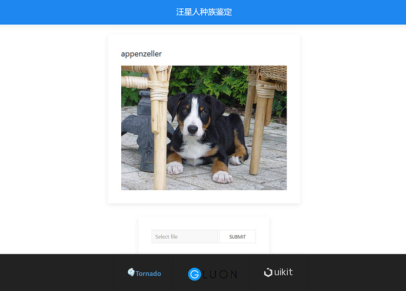

# Dog-Breed-Identification-Gluon
[Kaggle 120种狗分类比赛](https://www.kaggle.com/c/dog-breed-identification) Gluon实现代码  
通过[Gluon教程](http://zh.gluon.ai/chapter_computer-vision/kaggle-gluon-dog.html)，边学边练。使用`renset152_v1`和`inception_v3`进行模型融合得到`0.27760`分数

详细参见[Gluon炼丹（Kaggle 120种狗分类，迁移学习加双模型融合）](https://fiercex.github.io/post/gluon_kaggle/)

# 环境
- python 3.5+
- mxnet 20171225以上
- numpy 1.13.3
- tqdm 4.11.2 (进度条)
- matplotlib 2.0.2
- tornado 4.5.2 (web展示网页的web框架和服务器，不需要可不装)
# 简易web网页展示
效果如图  

  

训练好之后运行`app.py`即可 (需要安装`tornado`)
# 感悟
在[杨培文](https://github.com/ypwhs/DogBreed_gluon)的代码中学到的，如果使用imagenet网络进行预训练，锁住特征层的话，那可以先把所有数据都都过一边特征层网络，这样在后面进行分类输出网络的训练时会省去很多时间和显存，并且在训练的时候可以把bs开到很大，而且在过特征层网络的时候，可以把bs设的小一点，而且不用反向传播，速度也不会太慢，这样就解决了在低配电脑上无法训练的问题。而且用最新版mxnet输出的特征数据非常小，70M左右，后面的分类层即使用cpu也能跑很顺畅

